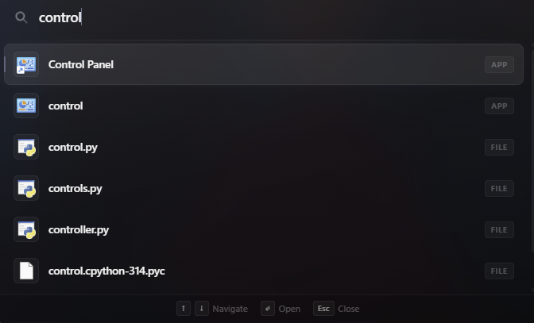
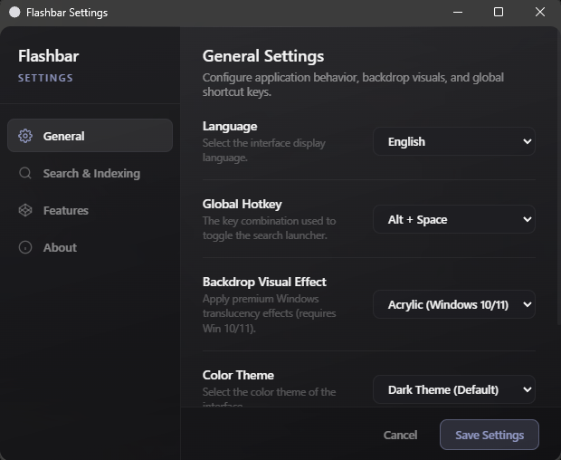

# Flashbar

Flashbar is a minimal, elegant, and high-performance keyboard launcher designed for Windows. It provides instant access to your applications, files, directories, and system tools with a premium glassmorphic overlay.

## Key Features

- **Fast Indexing**: Combines a quick startup index (Start Menu, Desktop, User Documents, and Downloads) with an optional deep NTFS Master File Table (MFT) scan for instant system-wide searches.
- **Dynamic Backdrop Effects**: Supports Windows 11 and 10 native Mica and Acrylic translucent blur effects, matching your active Windows theme.
- **Multilingual Support**: Fully localized in 10 languages, including English, Turkish, Chinese, German, Spanish, French, Italian, Russian, Portuguese, and Arabic.
- **Active Game Detection**: Suppresses the launcher overlay automatically when a fullscreen game or application is in the foreground, avoiding anti-cheat false positives and input conflicts.
- **Win+R Command Runner**: Execute system utilities, environment paths, and command-line instructions directly by prefixing queries with "run:".
- **Built-in Calculator**: Evaluate mathematical expressions directly from the search bar.
- **Drag and Drop**: Drag file search results directly out of the launcher to copy them to Windows Explorer or other applications.
- **Live Background Updates**: Checks for updates silently from GitHub Releases on startup, automatically replacing the binary and showing release notes without user intervention.

---

## Pre-requisites & Security Bypass

To ensure a smooth user experience, the setup installer automatically performs the following security configurations:
1. **Self-Signed Code Certificate**: Registers the local code-signing certificate under the system's "Trusted Root Certification Authorities" and "Trusted Publishers" stores. This permanently bypasses Windows SmartScreen warnings.
2. **UAC Bypass**: Configures a system-wide Windows Task Scheduler task to run the application with Administrator privileges on user logon, preventing future UAC popups during boot.

---

## Installation Guide for Testers

1. Download the installer: **Flashbar_0.1.0_x64-setup.exe**.
2. Run the installer (requires administrator privileges to register the certificate and Task Scheduler startup bypass).
3. Select your preferred installation language from the dropdown menu.
4. Complete the installation wizard.
5. The application will start automatically. You can also trigger it manually from the installation folder.

---

## How to Use

- **Toggle Launcher**: Press `Alt + Space` (default shortcut) to show or hide the search bar.
- **Launch Files/Apps**: Type your query and press `Enter` to run the selected item.
- **System Tray**: Right-click the Flashbar icon in the system tray (bottom-right taskbar) to access:
  - **Show Flashbar**: Open the launcher overlay.
  - **Settings**: Change shortcut keys, language, exclusions, themes, and indexing limits.
  - **What's New**: View the release notes of the current version.
  - **Quit**: Close the application completely.

---

## Previews

Below are previews of the application interface:

### Search Bar Overlay

### Settings Panel

